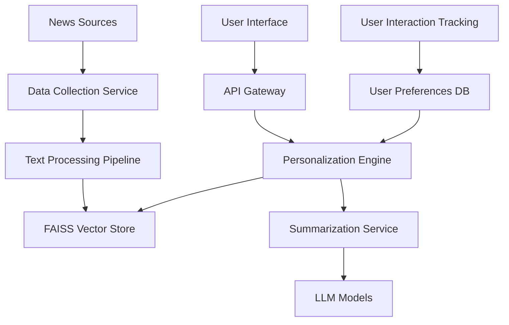

# SmartKhabar Design Document

## Overview

SmartKhabar is architected as a serverless, AI-powered news aggregation platform that leverages semantic search and intelligent summarization to deliver personalized news experiences. The system combines multiple news sources, FAISS vector storage, Langchain orchestration, and modern web technologies to create a scalable, responsive news companion that adapts to individual user preferences and reading habits.

## Architecture

### High-Level Architecture



### System Components

1. **Data Collection Layer**: Handles news source integration and content extraction
2. **Processing Pipeline**: Text cleaning, chunking, and embedding generation
3. **Storage Layer**: FAISS vector database and user preferences storage
4. **Personalization Engine**: Semantic search and content matching
5. **AI Services**: Langchain-orchestrated summarization and tone adaptation
6. **Frontend Interface**: React-based responsive web application
7. **Deployment Infrastructure**: Vercel serverless hosting

## Components and Interfaces

### 1. News Collection Service

**Purpose**: Aggregate content from multiple news sources
**Technology**: Node.js with news APIs and Firecrawl for custom scraping

```typescript
interface NewsArticle {
  id: string;
  headline: string;
  content: string;
  source: string;
  category: string;
  publishedAt: Date;
  url: string;
  tags: string[];
}

interface NewsCollector {
  collectFromAPI(source: string): Promise<NewsArticle[]>;
  scrapeCustomSource(url: string): Promise<NewsArticle[]>;
  scheduleCollection(): void;
}
```

### 2. Text Processing Pipeline

**Purpose**: Transform raw articles into searchable, semantic chunks
**Technology**: Langchain with Hugging Face embeddings

```typescript
interface TextChunk {
  id: string;
  articleId: string;
  content: string;
  embedding: number[];
  metadata: ChunkMetadata;
}

interface ChunkMetadata {
  source: string;
  category: string;
  publishedAt: Date;
  chunkIndex: number;
  wordCount: number;
}

interface TextProcessor {
  cleanText(content: string): string;
  chunkArticle(article: NewsArticle): TextChunk[];
  generateEmbeddings(chunks: TextChunk[]): Promise<TextChunk[]>;
}
```

### 3. FAISS Vector Store

**Purpose**: Efficient semantic search and retrieval
**Technology**: FAISS with metadata filtering

```typescript
interface VectorStore {
  addChunks(chunks: TextChunk[]): Promise<void>;
  searchSimilar(query: number[], filters: SearchFilters): Promise<SearchResult[]>;
  updateIndex(): Promise<void>;
}

interface SearchFilters {
  categories?: string[];
  sources?: string[];
  dateRange?: DateRange;
  minRelevanceScore?: number;
}

interface SearchResult {
  chunk: TextChunk;
  relevanceScore: number;
}
```

### 4. User Preferences Management

**Purpose**: Store and manage user personalization settings
**Technology**: Supabase/MongoDB for persistence

```typescript
interface UserPreferences {
  userId: string;
  topics: string[];
  tone: 'formal' | 'casual' | 'fun';
  readingTime: number; // minutes
  preferredSources: string[];
  excludedSources: string[];
  lastUpdated: Date;
}

interface UserInteraction {
  userId: string;
  articleId: string;
  action: 'read_more' | 'hide' | 'like' | 'share';
  timestamp: Date;
}
```

### 5. Personalization Engine

**Purpose**: Match users with relevant content using semantic search
**Technology**: Custom algorithm with FAISS integration

```typescript
interface PersonalizationEngine {
  generateUserQuery(preferences: UserPreferences): number[];
  findRelevantContent(userId: string): Promise<NewsArticle[]>;
  updateUserProfile(interactions: UserInteraction[]): Promise<void>;
  rankArticles(articles: NewsArticle[], preferences: UserPreferences): NewsArticle[];
}
```

### 6. Summarization Service

**Purpose**: Generate personalized, tone-adapted summaries
**Technology**: Langchain with OpenAI/Hugging Face models

```typescript
interface SummaryRequest {
  articles: NewsArticle[];
  tone: string;
  maxReadingTime: number;
  userId: string;
}

interface Summary {
  id: string;
  content: string;
  keyPoints: string[];
  sourceArticles: string[];
  estimatedReadingTime: number;
  tone: string;
}

interface SummarizationService {
  generateSummary(request: SummaryRequest): Promise<Summary>;
  adaptTone(content: string, targetTone: string): Promise<string>;
  consolidateTopics(articles: NewsArticle[]): Promise<Summary[]>;
}
```

### 7. API Gateway

**Purpose**: Handle client requests and orchestrate services
**Technology**: Next.js API routes

```typescript
interface APIEndpoints {
  '/api/news/personalized': GET; // Get user's personalized feed
  '/api/preferences': GET | PUT; // Manage user preferences
  '/api/articles/summary': POST; // Generate article summary
  '/api/interactions': POST; // Track user interactions
  '/api/sources': GET; // Get available news sources
}
```

## Data Models

### Database Schema

**User Preferences Collection**
```json
{
  "userId": "string",
  "preferences": {
    "topics": ["technology", "business", "science"],
    "tone": "casual",
    "readingTime": 5,
    "preferredSources": ["techcrunch", "bbc"],
    "excludedSources": ["source1"]
  },
  "interactionHistory": [
    {
      "articleId": "string",
      "action": "read_more",
      "timestamp": "ISO_DATE"
    }
  ],
  "createdAt": "ISO_DATE",
  "updatedAt": "ISO_DATE"
}
```

**Article Metadata Collection**
```json
{
  "articleId": "string",
  "headline": "string",
  "source": "string",
  "category": "string",
  "publishedAt": "ISO_DATE",
  "url": "string",
  "tags": ["tag1", "tag2"],
  "chunkIds": ["chunk1", "chunk2"],
  "processingStatus": "completed"
}
```

### FAISS Index Structure

- **Vector Dimensions**: 384 (sentence-transformers/all-MiniLM-L6-v2)
- **Index Type**: IndexFlatIP (Inner Product for cosine similarity)
- **Metadata Storage**: Parallel arrays for chunk metadata
- **Update Strategy**: Incremental updates with periodic full rebuilds

## Error Handling

### Error Categories and Responses

1. **News Collection Failures**
   - Retry mechanism with exponential backoff
   - Fallback to cached content
   - Graceful degradation with available sources

2. **Embedding Generation Errors**
   - Queue failed articles for retry
   - Use fallback keyword-based search
   - Log errors for monitoring

3. **Summarization Failures**
   - Provide original article excerpts
   - Display fallback message to user
   - Track failure rates for model optimization

4. **Database Connection Issues**
   - Implement connection pooling
   - Use read replicas for high availability
   - Cache frequently accessed data

### Error Response Format

```typescript
interface ErrorResponse {
  error: {
    code: string;
    message: string;
    details?: any;
  };
  fallback?: {
    type: 'cached_content' | 'default_feed' | 'excerpt';
    data: any;
  };
}
```

## Testing Strategy

### Unit Testing
- **Components**: Individual service functions and utilities
- **Coverage Target**: 80% code coverage
- **Tools**: Jest, React Testing Library
- **Focus Areas**: Text processing, embedding generation, summarization logic

### Integration Testing
- **API Endpoints**: Full request/response cycles
- **Database Operations**: CRUD operations and queries
- **External Services**: News API integrations with mocked responses
- **Vector Search**: FAISS operations with test datasets

### End-to-End Testing
- **User Flows**: Complete personalization and summarization workflows
- **Performance Testing**: Response times under load
- **Cross-browser Testing**: Responsive design validation
- **Tools**: Playwright, Lighthouse for performance

### Testing Data Strategy
- **Mock News Data**: Curated test articles across categories
- **User Personas**: Predefined preference profiles for testing
- **Embedding Fixtures**: Pre-computed embeddings for consistent testing
- **Performance Benchmarks**: Response time and accuracy metrics

## Deployment Architecture

### Vercel Configuration
- **Framework**: Next.js with API routes
- **Build Process**: Automated CI/CD with GitHub integration
- **Environment Variables**: Secure API key management
- **Edge Functions**: Geographic distribution for low latency

### External Services Integration
- **Database**: Supabase for user data with connection pooling
- **Vector Storage**: FAISS files stored in Vercel's file system
- **LLM Services**: OpenAI API with rate limiting and fallbacks
- **Monitoring**: Vercel Analytics and custom error tracking

### Scalability Considerations
- **Serverless Functions**: Auto-scaling based on demand
- **Database Optimization**: Indexed queries and connection management
- **Caching Strategy**: Redis for frequently accessed summaries
- **CDN**: Static asset optimization through Vercel's edge network